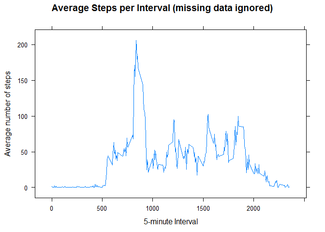

# Reproducible Research: Peer Assessment 1


## Loading and preprocessing the data

This secton loads the data and displays the structure and other information about it.


```r
d <- read.csv(unz("activity.zip","activity.csv"))
str(d)
```

```
## 'data.frame':	17568 obs. of  3 variables:
##  $ steps   : int  NA NA NA NA NA NA NA NA NA NA ...
##  $ date    : Factor w/ 61 levels "2012-10-01","2012-10-02",..: 1 1 1 1 1 1 1 1 1 1 ...
##  $ interval: int  0 5 10 15 20 25 30 35 40 45 ...
```

```r
head(d)
```

```
##   steps       date interval
## 1    NA 2012-10-01        0
## 2    NA 2012-10-01        5
## 3    NA 2012-10-01       10
## 4    NA 2012-10-01       15
## 5    NA 2012-10-01       20
## 6    NA 2012-10-01       25
```

```r
summary(d)
```

```
##      steps                date          interval     
##  Min.   :  0.00   2012-10-01:  288   Min.   :   0.0  
##  1st Qu.:  0.00   2012-10-02:  288   1st Qu.: 588.8  
##  Median :  0.00   2012-10-03:  288   Median :1177.5  
##  Mean   : 37.38   2012-10-04:  288   Mean   :1177.5  
##  3rd Qu.: 12.00   2012-10-05:  288   3rd Qu.:1766.2  
##  Max.   :806.00   2012-10-06:  288   Max.   :2355.0  
##  NA's   :2304     (Other)   :15840
```

This process the data into a table using the *dplyr* package for this and subsequent processing. Data is copied into a table grouped by date first.


```r
library(dplyr)
```

```
## Warning: package 'dplyr' was built under R version 3.1.3
```

```
## 
## Attaching package: 'dplyr'
## 
## The following object is masked from 'package:stats':
## 
##     filter
## 
## The following objects are masked from 'package:base':
## 
##     intersect, setdiff, setequal, union
```

```r
d <- tbl_df(d)
d1 <- group_by(d, date)
```

Calculate the mean total number of steps taken per day by calculating the total number of steps per day and putting that in a data table with date and total steps.


```r
# calculate total steps per day then take the mean by day
tspd <- summarise(d1,total=sum(steps,na.rm=TRUE))
mspd <- mean(tspd$total,na.rm=TRUE)
mspd
```

```
## [1] 9354.23
```
The mean steps per day is *9354.23*.

Here is the table with the total steps per day.  

```r
# tspd already holds the total number of steps per day
tspd
```

```
## Source: local data frame [61 x 2]
## 
##          date total
## 1  2012-10-01     0
## 2  2012-10-02   126
## 3  2012-10-03 11352
## 4  2012-10-04 12116
## 5  2012-10-05 13294
## 6  2012-10-06 15420
## 7  2012-10-07 11015
## 8  2012-10-08     0
## 9  2012-10-09 12811
## 10 2012-10-10  9900
## ..        ...   ...
```

```r
summary(tspd)
```

```
##          date        total      
##  2012-10-01: 1   Min.   :    0  
##  2012-10-02: 1   1st Qu.: 6778  
##  2012-10-03: 1   Median :10395  
##  2012-10-04: 1   Mean   : 9354  
##  2012-10-05: 1   3rd Qu.:12811  
##  2012-10-06: 1   Max.   :21194  
##  (Other)   :55
```

This code produces a histogram of total steps per day using the *lattice* graphics package.


```r
# tspd hold the total number of steps per day
library(lattice)
histogram(~total,data=tspd, type="percent", 
    breaks=c(0,2500,5000,7500,10000,12500,15000,17500,20000,22599,25000), 
    xlab="Total Steps per Day", 
    main ="Histogram of Total Steps per Day")
```

```
## Warning in histogram.formula(~total, data = tspd, type = "percent", breaks
## = c(0, : type='percent' can be misleading in this context
```

 


## What is mean total number of steps taken per day?


This calculates and report the mean and median of the total number of steps taken per day.


```r
mean_spd <- mean(tspd$total, na.rm=TRUE)
median_spd <- median(tspd$total, na.rm=TRUE)
```
Mean steps per day: **9354.23**  
Median steps per day: **10395**  


## What is the average daily activity pattern?


This makes a time series plot of the 5-minute interval and the average number of steps taken across all days. The data is grouped by day then a table is created of the date and mean number of steps.


```r
# group data by interval, calculate mean steps per interval, and then plot.
d2 <- group_by(d, interval) 
mspi <- summarise(d2, average=mean(steps, na.rm=TRUE))
xyplot(average ~ interval, mspi, type="l", 
            main="Average Steps per Interval (missing data ignored)",
            ylab="Average number of steps",xlab="5-minute Interval")
```

 

This determines Which 5-minute interval, on average across all the days in the dataset, contains the maximum number of steps.


```r
mspi_ordered<-arrange(mspi,desc(average))
mspi_ordered[1,]
```

```
## Source: local data frame [1 x 2]
## 
##   interval  average
## 1      835 206.1698
```

```r
maxint <- mspi_ordered[1,]$interval
```

The interval with the maximum number of steps on average is **interval number 835.**


## Imputing missing values


This culculates the total number of missing values in the dataset.


```r
na_count <- sum(is.na(d$steps))
na_count
```

```
## [1] 2304
```
There are **2304** missing values (i.e., steps=NA).

This code creates a new dataset that is equal to the original dataset with mean steps per interval substituted for the missing data for that inteval.

Note this is not an ideal strategy. For example, on days with no data reported, it substitutes the same number of steps in each interval creating identical days to the average without regard to other acitvity that day. 


```r
# mspi is the mean number of steps each interval.
summary(mspi)
```

```
##     interval         average       
##  Min.   :   0.0   Min.   :  0.000  
##  1st Qu.: 588.8   1st Qu.:  2.486  
##  Median :1177.5   Median : 34.113  
##  Mean   :1177.5   Mean   : 37.383  
##  3rd Qu.:1766.2   3rd Qu.: 52.835  
##  Max.   :2355.0   Max.   :206.170
```

```r
d3 <- d
summary(d3)
```

```
##      steps                date          interval     
##  Min.   :  0.00   2012-10-01:  288   Min.   :   0.0  
##  1st Qu.:  0.00   2012-10-02:  288   1st Qu.: 588.8  
##  Median :  0.00   2012-10-03:  288   Median :1177.5  
##  Mean   : 37.38   2012-10-04:  288   Mean   :1177.5  
##  3rd Qu.: 12.00   2012-10-05:  288   3rd Qu.:1766.2  
##  Max.   :806.00   2012-10-06:  288   Max.   :2355.0  
##  NA's   :2304     (Other)   :15840
```

```r
imp <- numeric(na_count)
count <- 0
# substitute this value for missing values.
for (i in 1:nrow(d3)) 
    if (is.na(d3[i,"steps"])) {
         d3[i,"steps"] <- mspi[which(mspi$interval==d3$interval[i]),"average"]
         count <- count+1
         imp[count] <- as.numeric(mspi[which(mspi$interval==d3$interval[i]),"average"])
    }
summary(imp)
```

```
##    Min. 1st Qu.  Median    Mean 3rd Qu.    Max. 
##   0.000   2.486  34.110  37.380  52.830 206.200
```

```r
summary(d3)
```

```
##      steps                date          interval     
##  Min.   :  0.00   2012-10-01:  288   Min.   :   0.0  
##  1st Qu.:  0.00   2012-10-02:  288   1st Qu.: 588.8  
##  Median :  0.00   2012-10-03:  288   Median :1177.5  
##  Mean   : 37.38   2012-10-04:  288   Mean   :1177.5  
##  3rd Qu.: 27.00   2012-10-05:  288   3rd Qu.:1766.2  
##  Max.   :806.00   2012-10-06:  288   Max.   :2355.0  
##                   (Other)   :15840
```

Here is a histogram of the total number of steps taken each day with the imputed data. 


```r
d4 <- group_by(d3, date)
tspd2 <- summarise(d4,total=sum(steps))
summary(tspd2)
```

```
##          date        total      
##  2012-10-01: 1   Min.   :   41  
##  2012-10-02: 1   1st Qu.: 9819  
##  2012-10-03: 1   Median :10766  
##  2012-10-04: 1   Mean   :10766  
##  2012-10-05: 1   3rd Qu.:12811  
##  2012-10-06: 1   Max.   :21194  
##  (Other)   :55
```

```r
mspd2 <- mean(tspd2$total)
histogram(~total, data=tspd2, 
   breaks=c(0,2500,5000,7500,10000,12500,15000,17500,20000,22599,25000), 
          type="percent", xlab="Total steps", 
          main ="Histogram of Total Steps per Day (missing data inputed)")
```

```
## Warning in histogram.formula(~total, data = tspd2, breaks = c(0, 2500,
## 5000, : type='percent' can be misleading in this context
```

 
  
This calculates the mean and median total number of steps taken per day with the imputed data.  


```r
mean_spd2 <- mean(tspd2$total)
median_spd2 <- median(tspd2$total)
```
Mean steps per day: **10766.19**  
Median steps per day: **10766.19**  

The mean and median differ from the estimates from the first part of the assignment. Both are made larger by imputing missing data. In this case the median also equals the mean, because the same data is substituted for days with no data. Overall, the estimates of the total daily number of steps is per day is often increased.


## Are there differences in activity patterns between weekdays and weekends?

This creates a new factor variable in the dataset with two levels - "weekday" and "weekend" indicating whether a given date is a weekday or weekend day.


```r
typeday <- ifelse(weekdays(as.Date(d3$date)) %in% c("Saturday","Sunday"),
                     "weekend", "weekday")
d3$typeday <- as.factor(typeday)
d3 <- group_by(d3,interval,typeday)
mspi2 <- summarise(d3,avg=mean(steps))
mspi2
```

```
## Source: local data frame [576 x 3]
## Groups: interval
## 
##    interval typeday         avg
## 1         0 weekday 2.251153040
## 2         0 weekend 0.214622642
## 3         5 weekday 0.445283019
## 4         5 weekend 0.042452830
## 5        10 weekday 0.173165618
## 6        10 weekend 0.016509434
## 7        15 weekday 0.197903564
## 8        15 weekend 0.018867925
## 9        20 weekday 0.098951782
## 10       20 weekend 0.009433962
## ..      ...     ...         ...
```

This creates a plot containing the 5-minute interval and the average number of steps taken, averaged across all weekday days or weekend days. 


```r
xyplot(avg ~ interval | typeday, mspi2, type="l", layout=c(1,2),
            main="Average Steps per Interval (missing data imputed)",
            ylab="Average number of steps",xlab="5-minute Interval")
```

 

We see a marked difference in activity patterns bedtween weekend days and weekday days. Weekday activity starts earlier in the day. It has one major peak earier in the day and another in the afternoon and evening. The weekend day data has a morning peak, but many more significant peaks through the day. Weekend activity is also higher later in the evening. Overall, there seems to be more activity on weekend days.
